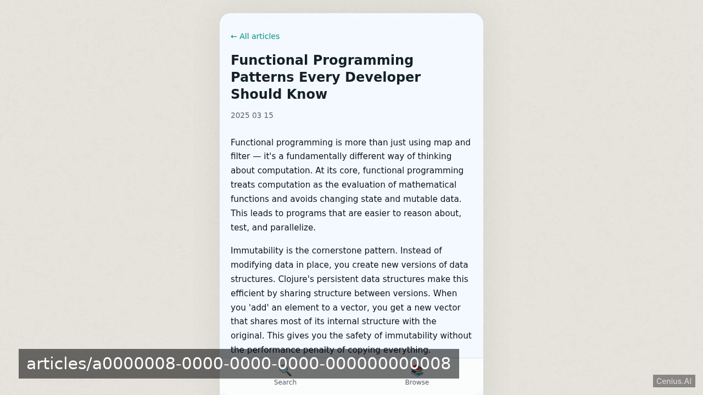
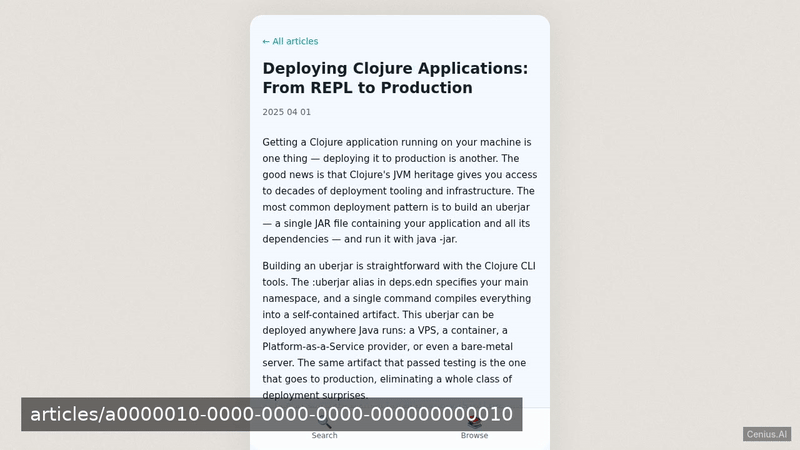
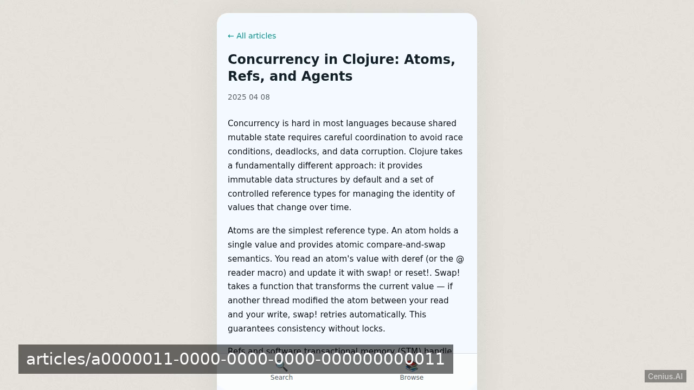
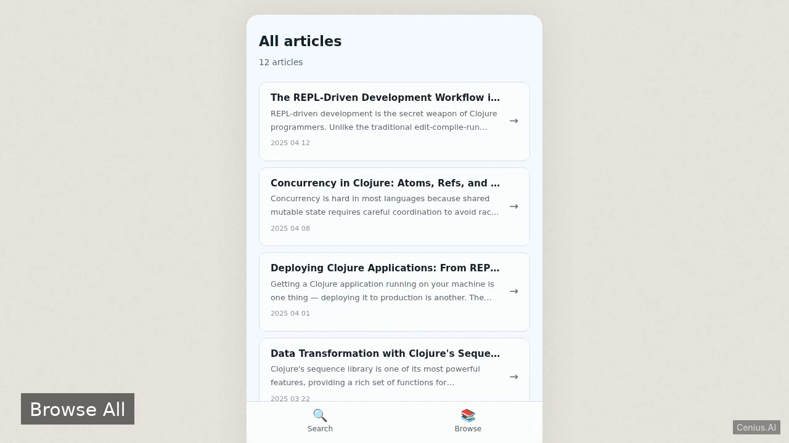
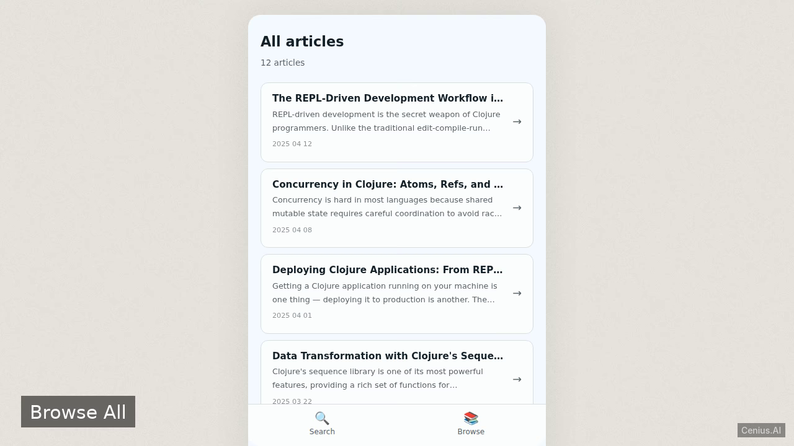

# Article Search Engine — Clojure search engine app reference implementation

This repository contains the complete source for **Article Search Engine**, an open-source search engine app built with Clojure. A minimal Clojure web application using Ring and Compojure that allows visitors to search a list of articles by keyword, backed by PostgreSQL. Everything Article Search Engine needs to run is here — code, seed data, install scripts. Apache-2.0-licensed — use Article Search Engine commercially, self-host it, or [remix Article Search Engine on cenius.ai](https://cenius.ai/marketplace/p/article-search-engine?ref=gh&utm_campaign=article-search-engine-clojure) to make it yours.


[](LICENSE)  [](https://cenius.ai)

[](https://cenius.ai/marketplace/p/article-search-engine?ref=gh&utm_campaign=article-search-engine-clojure)

> **▶ [Open & edit in cenius.ai](https://cenius.ai/marketplace/p/article-search-engine?ref=gh&utm_campaign=article-search-engine-clojure)** — one click to an editable workspace: describe changes in plain English, get an instant preview, one-click deploy and host. Modifications made on the platform come with full rebrand & relicense rights.

_Local clone? See [Quick start](#quick-start) below. cenius.ai is the zero-setup path._

## Demo





📽 **[Demo video on cenius.ai](https://cenius.ai/marketplace/p/article-search-engine?ref=gh&utm_campaign=article-search-engine-clojure)** — the complete run-through · [MP4](.github/media/demo.mp4)

## Screenshots

  

## Features

- Keyword article search

## Quick start

```bash
./install.sh   # installs dependencies + seeds demo data
```

See [`INSTALL.md`](INSTALL.md) for full setup and usage instructions.

## Architecture

Clojure project, delivered as a complete runnable codebase (29 files). Top-level layout: `data/`, `resources/`, `src/`, `test/`. `install.sh` wires up dependencies and loads seed records; after it runs the app has real data to show. Full setup details: [`INSTALL.md`](INSTALL.md).

## Usage guide

### Overview

Article Search is a single-page-style web application with a mobile-first bottom-tab layout. Two main tabs anchor the experience: **Search** and **Browse**.

### Screens

#### Search (`/`)

The home screen. You'll see:

- A **search form** — type a keyword and press Enter or click the arrow button
- **Recent articles** — the six newest articles as cards; click any to read it

Try searching for: "Clojure", "database", "functional", "Ring", "testing"

#### Search Results (`/search?q=…`)

After submitting a search:

- A **header** tells you how many articles matched your query
- Each result card shows the **title**, a **snippet** with your keyword **highlighted** in accent, and the **date**
- The search form stays visible so you can refine your query immediately

If no articles match, you'll see a friendly empty state suggesting you browse all articles.

#### Browse All (`/articles`)

A scrollable list of every article, newest first. Each row shows the title, a brief snippet, and the date. Tap any article to read it in full.

#### Article Detail (`/articles/:id`)

The full text of a single article, rendered as readable paragraphs. A back link returns you to the article list.

### Keyboard & accessibility

- **Tab** navigates between interactive elements
- **Enter** submits forms and follows links
- All interactive elements have visible focus rings
- The layout respects `prefers-reduced-motion`

### JSON API

For programmatic access, use the search API:

```
GET /api/search?q=immutability
```

Returns:

_Full guide: [`USAGE.md`](USAGE.md)_

## FAQ

### Can I deploy Article Search Engine on my own infrastructure?

Clone this repository and run `./install.sh`, then start the app as described in [`INSTALL.md`](INSTALL.md). Article Search Engine is fully self-hostable — no external services are required to try it.

### Can I use Article Search Engine in a commercial project?

Confirmed free for commercial use — MIT terms let you incorporate, resell, or ship it in any product. [LICENSE](LICENSE).

### How do I customise Article Search Engine's branding?

Yes. The MIT license lets you remove the original branding and ship under your own name. For a guided approach, [remix it on cenius.ai](https://cenius.ai/marketplace/p/article-search-engine?ref=gh&utm_campaign=article-search-engine-clojure): you get a fresh build with full rebrand and relicense rights.

### Can non-developers customise Article Search Engine?

Open it on [cenius.ai](https://cenius.ai/marketplace/p/article-search-engine?ref=gh&utm_campaign=article-search-engine-clojure) and describe the changes you want in plain English — the platform modifies the app and gives you a new, downloadable build.

### Which framework or language does Article Search Engine use?

Clojure. The full source in this repository is exactly what the app runs. Highlights include keyword article search.

## License & rebranding

Released under the [Apache License 2.0](LICENSE) (© 2026 Cenius AI) — free for personal and commercial use. The Cenius name/logo are trademarks (see NOTICE).

**Need a customized version?** [Remix this app on cenius.ai](https://cenius.ai/marketplace/p/article-search-engine?ref=gh&utm_campaign=article-search-engine-clojure) — modifications made on the platform come with **full rebrand & relicense rights** over your derivative.

## Built with cenius.ai

This entire application — code, design, seeded demo data — was generated on **[cenius.ai](https://cenius.ai)** from a plain-English description.

- 🚀 [Build your own app on cenius.ai](https://cenius.ai)
- 🎛️ [Remix Article Search Engine on the marketplace](https://cenius.ai/marketplace/p/article-search-engine?ref=gh&utm_campaign=article-search-engine-clojure) — open it in a workspace, prompt for changes, and ship your own version.

More open-source apps: [the Cenius-ai catalog](https://github.com/Cenius-ai) · [showcase index](https://github.com/Cenius-ai/showcase)
